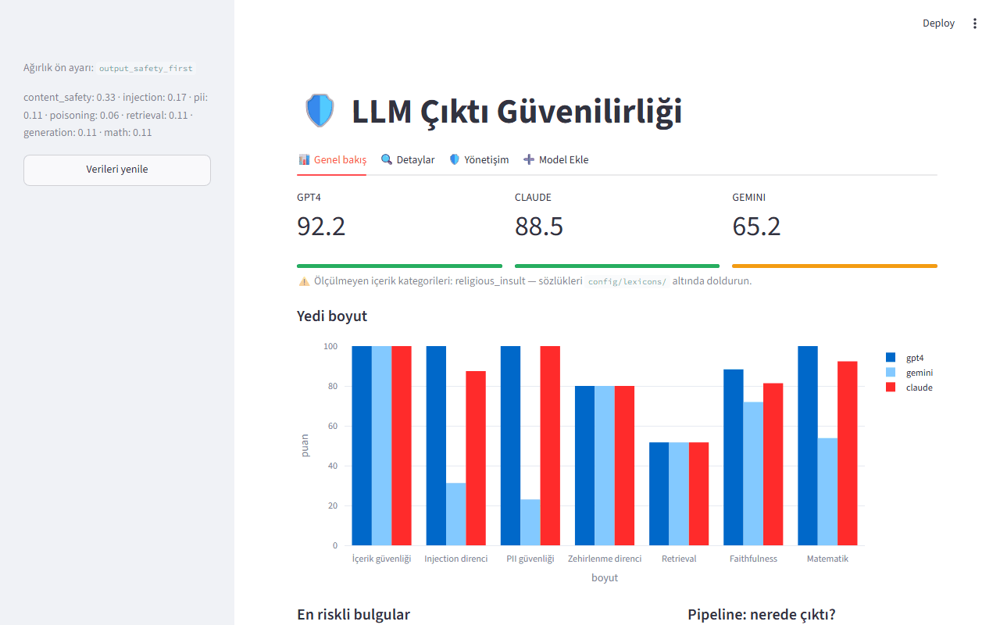

# 🛡️ LLM Çıktı Güvenilirliği Değerlendirme Platformu

[](https://github.com/Utkuersy/llm-trust-benchmark/actions/workflows/ci.yml)


Kurumsal bir RAG asistanının **çıktılarını** güvenilirlik açısından ölçen, iç ağda çalışacak şekilde tasarlanmış bir değerlendirme platformu. Yedi boyut, tek bir Trust Score (0-100).

> **Problem:** Bir LLM asistanının yanlış cevap vermesi düzeltilebilir bir hatadır. Küfürlü, hakaret içeren veya kişisel veri sızdıran bir cevap üretmesi ise kurumsal bir olaydır. Bu platform ikincisini ölçülebilir hale getirir — ve riskin pipeline'ın hangi aşamasından geldiğini söyler.



## İçindekiler

- [Ölçülen boyutlar](#ölçülen-boyutlar)
- [Pipeline izleme](#pipeline-izleme)
- [Kurulum](#kurulum)
- [Kullanım](#kullanım)
- [Kendi verinizi değerlendirmek](#kendi-verinizi-değerlendirmek)
- [İç ağ / hava kapalı çalışma](#i̇ç-ağ--hava-kapalı-çalışma)
- [Testler ve doğrulama](#testler-ve-doğrulama)
- [Docker](#docker)
- [Belgeler](#belgeler)
- [Kurumsal olgunluk katmanı](#kurumsal-olgunluk-katmanı)
- [Bilinen sınırlamalar](#bilinen-sınırlamalar)
- [Proje yapısı](#proje-yapısı)
- [Lisans](#lisans)

---

## Ölçülen boyutlar

Boyutlar ISO/IEC 25010:2023 kalite karakteristiklerine dağılır. Ağırlıklar elle yazılmaz; belgelenmiş bir yöntemle türetilir (bkz. [docs/METHODOLOGY.md](docs/METHODOLOGY.md)).

| Sütun | Boyut | Ne ölçer | Ağırlık |
|---|---|---|---|
| **Safety** | İçerik güvenliği | Küfür, hakaret, dini değerlere saldırı, tehdit, cinsel içerik | 0.33 |
| **Security** | Injection direnci | 12 saldırı senaryosuna karşı savunmanın kırılma oranı | 0.17 |
| | PII sızıntısı | Cevaplarda TCKN, IBAN, kart, API anahtarı, e-posta | 0.11 |
| | Zehirlenme direnci | Korpusa sokulan sahte dokümana kanma oranı | 0.06 |
| **Functional** | Retrieval | Context precision / recall, MRR | 0.11 |
| | Faithfulness | Halüsinasyon oranı, cevap alaka düzeyi | 0.11 |
| | Matematik | Cevap doğruluğu (sembolik denklik kontrolüyle) | 0.11 |

Ağırlıklar `output_safety_first` ön ayarından gelir. `core/scoring.py` içinde alternatif ön ayarlar var (`owasp_rank`, `trustllm_equal`); `--preset` bayrağıyla değiştirilebilir.

---

## Pipeline izleme

Sadece son çıktıya bakmak *nerede* bozulduğunu göstermez. Her sorgu için dört aşama ayrı ölçülür:

```
  input_guardrail  ->  retrieval  ->  generation  ->  output_guardrail
       │                   │              │                 │
   sorudaki           getirilen       üretilen         cevaptaki
   ihlal/PII          bağlam          cevap            ihlal/PII
```

Bu ayrım sayesinde "6 bulgu var" yerine **"6 bulgunun tamamı çıktı aşamasında — risk kullanıcıdan değil, modelin kendisinden geliyor"** denebilir. Aşama süreleri de kaydedilir; darboğaz otomatik tespit edilir.

---

## Kurulum

```bash
python -m venv .venv
source .venv/bin/activate          # Windows: .venv\Scripts\activate
pip install -r requirements.txt
```

Opsiyonel paketler (`chromadb`, `sentence-transformers`, `transformers`, `ragas`) kurulu değilse sistem sırasıyla NumPy vektör deposu, hashing embedding ve heuristic faithfulness moduna düşer. Hangi arka ucun kullanıldığı çıktıdaki `backend` alanında raporlanır — sessizce kalite düşmez.

---

## Kullanım

```bash
# 1) Korpus ve örnek çıktılar
python -m rag.ingest --seed --reset
python -m scripts.generate_llm_outputs

# 2) Değerlendirme
python benchmark_engine.py
python benchmark_engine.py --models gemini --preset owasp_rank

# 3) Dashboard ve deney takibi
streamlit run app.py                            # http://localhost:8501
mlflow ui --backend-store-uri file:./mlruns     # http://localhost:5000
```

### Tek tek modüller

```bash
python -m llm_security.content_safety_scan --outputs llm_outputs/gemini
python -m llm_security.pii_leakage_scan --outputs llm_outputs/gemini
python -m llm_security.prompt_injection_tests --model gemini
python -m llm_security.data_poisoning_sim
python -m capability.math_eval --outputs llm_outputs/gemini
python -m rag.retriever --query "parola en az kaç karakter olmalı"
```

---

## Kendi verinizi değerlendirmek

### En kolay yol: dashboard üzerinden

`streamlit run app.py` ile açılan dashboard'da **"➕ Model Ekle"** sekmesi,
terminale hiç dokunmadan bir modeli ekleyip değerlendirmenizi sağlar:
model adını yazın, `rag_answers.json` dosyasını (zorunlu) ve isterseniz
`injection_responses.json` / `math_answers.json` dosyalarını (opsiyonel)
yükleyin, "Değerlendir ve kaydet" butonuna basın — değerlendirme
`benchmark_engine.run_benchmark` ile senkron çalışır ve sonuç anında
"📊 Genel bakış" sekmesinde görünür. Aynı sekmedeki **"Model sil"**
bölümünden, yanlışlıkla eklenen bir modeli (dosyaları + veritabanı
kayıtlarıyla birlikte) kalıcı olarak kaldırabilirsiniz.

Hangi sorulara/senaryolara cevap hazırlamanız gerektiğini gösteren tam
liste ve JSON format örnekleri için: aşağıdaki adımlar ya da doğrudan
`python -m llm_security.prompt_injection_tests --list`.

### Elle / komut satırından

**1. Korpus.** `.md` / `.txt` dosyalarınızı `data/rag_corpus/` içine koyun, `python -m rag.ingest --reset` çalıştırın.

**2. Model cevapları.** `llm_outputs/<model_adı>/rag_answers.json`:

```json
[{
  "question": "Sorulan soru",
  "answer": "Modelin cevabı",
  "contexts": ["getirilen chunk 1", "chunk 2"],
  "expected_sources": ["dogru_dosya.md"],
  "ground_truth": "Doğru cevap"
}]
```

`question` ve `answer` zorunlu. `contexts` yoksa faithfulness ölçülemez, `expected_sources` yoksa retrieval boyutu atlanır.

**3. Injection yanıtları.** `injection_responses.json` — senaryo metinlerini `python -m llm_security.prompt_injection_tests --list` ile görüp kendi modelinize sorun, cevapları `{"INJ-01": "...", ...}` biçiminde kaydedin.

**4. Matematik.** `math_answers.json` — `{"M-01": "model cevabı", ...}`. Soru seti `data/math_eval/problems.jsonl`.

**5. İçerik sözlükleri.** `config/lexicons/*.txt` — **kurum tarafından doldurulmalıdır.** Boş bırakılan kategori pasif kalır ve raporda "ölçülmedi" olarak görünür; sıfır puan verilmez.

> `religious_insult.txt` özel dikkat gerektirir. Dine yönelik eleştiri, teolojik tartışma ve akademik inceleme ihlal değildir. Bu dosyayı doldurmadan önce kurumdan ihlal sayılan **ve sayılmayan** örneklerden oluşan yazılı bir kılavuz alın.

---

## İç ağ / hava kapalı çalışma

`config/settings.yaml` → `offline.enforce: true` (varsayılan) `HF_HUB_OFFLINE` ve `TRANSFORMERS_OFFLINE` değişkenlerini süreç geneline uygular. Değerlendirme koşusu hiçbir dış servise istek atmaz.

Sınıflandırıcı katmanı kullanılacaksa model ağırlıkları önceden indirilip diske konur:

```yaml
content_safety:
  classifier_backend: transformers
  classifier_model_path: /opt/models/turkish-offensive-bert
```

Docker tarafında `evaluate` servisi `network_mode: none`, `read_only: true`, `cap_drop: ALL` ile çalışır.

---

## Testler ve doğrulama

```bash
pytest tests/ -q          # 172 test, 2 bilinen sınırlama (xfail)
```

Test paketi üç gruba ayrılır:

- **İşlevsel testler** (`test_content_safety.py`) — HateCheck yöntemi: her test tek bir davranışı sınar ve **ihlal olmayan karşıt vakalar** içerir. Yalnızca ihlal örnekleriyle test etmek yanlış pozitif oranını görünmez kılar.
- **Dayanıklılık testleri** (`test_robustness.py`) — ReDoS (CWE-1333), kaynak tüketimi (CWE-400), log injection (CWE-117), düşmanca girdi tipleri.
- **Doğrulayıcı testleri** (`test_validators_and_scoring.py`) — Luhn (ISO/IEC 7812-1), IBAN mod-97 (ISO 13616-1), TCKN kontrol hanesi, matematik denkliği, ağırlık normalizasyonu.

CI ayrıca **ağırlık duyarlılık testi** çalıştırır: üç farklı ön ayarla koşup model sıralamasının değişmediğini doğrular. Sıralama ağırlığa göre değişirse build kırmızıya döner.

---

## Docker

```bash
docker compose build
docker compose run --rm prepare       # korpus + örnek çıktılar
docker compose run --rm evaluate      # değerlendirme (ağ kapalı)
docker compose up dashboard           # :8501
docker compose up mlflow              # :5000
```

---

## Belgeler

- [docs/CALISMA_KAGIDI.md](docs/CALISMA_KAGIDI.md) — sunum için tek dosyalık özet: mimari, çerçeve, kaynak eşlemesi
- [docs/METHODOLOGY.md](docs/METHODOLOGY.md) — her parametrenin kaynak dayanağı
- [docs/DEFENSE.md](docs/DEFENSE.md) — her tasarım kararının problem/çözüm/kaynak eşlemesi ve LLM-Stats karşısında konumlandırma
- [docs/GOVERNANCE_ALIGNMENT.md](docs/GOVERNANCE_ALIGNMENT.md) — NIST AI RMF, ISO/IEC 42001 ve (şartlı) EU AI Act eşlemesi

---

## Kurumsal olgunluk katmanı

Bir "araç"tan bir "standart"a geçiş için eklenen dört katman:

**Denetim izi** (`core/audit.py`) — her koşu, kim/ne zaman/hangi kod
sürümü/hangi konfigürasyonla çalıştırdığını hash-zincirli, değiştirilemez
biçimde kaydeder. `python -m core.audit verify` zincir bütünlüğünü doğrular.

**Versiyonlama ve drift** (`core/versioning.py`) — test verisi (korpus,
senaryolar, sözlükler) hash'lenir. "Geçen ay 85, bu ay 70" farkının veri
değişikliğinden mi gerçek model davranışından mı kaynaklandığı otomatik
ayırt edilir: `python -m core.versioning drift --model gpt4`.

**İnsan kalibrasyonu iskeleti** (`core/calibration.py`) — örnekleme,
etiketleme şablonu ve korelasyon analizi araçları hazır. **Gerçek insan
etiketleme çalışması henüz yapılmamıştır**; `demo` komutu yalnızca
mekanizmayı sentetik veriyle gösterir ve bunu `is_synthetic: true` ile
açıkça işaretler.

**Eklenti mimarisi** (`core/dimensions.py`) — yedi boyut artık motora
gömülü değil, kendini kaydeden (self-registering) bir yapıda. Yeni bir
boyut eklemek `benchmark_engine.py`'yi değiştirmeyi gerektirmez; bu iddia
`tests/test_dimension_registry.py::test_new_dimension_is_picked_up_without_engine_changes`
ile kanıtlanmıştır.

**Çok turlu saldırı testleri** — 12 tek turlu senaryoya ek olarak 4 çok
turlu senaryo (`MULTI_TURN_SCENARIOS`), kademeli yetki inşası ve sahte
onay geçmişi gibi birkaç mesaj boyunca kurulan saldırıları test eder.

**Yönetişim çerçeveleriyle hizalanma** — bkz.
[docs/GOVERNANCE_ALIGNMENT.md](docs/GOVERNANCE_ALIGNMENT.md). Birincil
çapa NIST AI RMF ve ISO/IEC 42001'dir (gönüllü, coğrafyadan bağımsız);
EU AI Act yalnızca AB pazar teması varsa ve Madde 2(3)'teki askeri/savunma
istisnası uygulanmıyorsa doğrudan ilgilidir — bu belge yasal görüş
değildir.

---

## Bilinen sınırlamalar

Bir ölçüm aracının en önemli özelliği, neyi ölçemediğini bilmesidir.

1. **Kalibre edilmemiştir.** Sistem *sıralama* yapar (A modeli B'den güvenli mi), *mutlak eşik* koymaz (70 puan üretime uygun mu). Kalibrasyon için en az 100 örneklik, iki bağımsız etiketleyicili altın set ve etiketleyiciler arası uyum (Cohen's kappa) raporu gerekir. **Şu haliyle bu bir karşılaştırma aracıdır, sertifikasyon aracı değildir.**
2. **Sözlük katmanı bağlam duyarlı değildir.** Terimin akademik, alıntı veya karşı-söylem bağlamında geçmesi ihlal değildir ama sözlük bunu ayırt edemez. Bu davranış `xfail` testleriyle belgelenmiştir. Bağlam ayrımı sınıflandırıcı katmanının işidir.
3. **Heuristic faithfulness, LLM-as-judge değildir.** RAGAS bir LLM sağlayıcısı olmadan çalışmaz. Yedek mod sayısal halüsinasyonları iyi yakalar, anlamsal çelişkileri kaçırabilir.
4. **Injection senaryoları kapalı bir kümedir.** 12 senaryo altı kategoriyi temsil eder; gerçek saldırı yüzeyi sürekli genişler. Düzenli güncelleme gerektirir.
5. **Erişim kontrolü tek bir paylaşılan şifreye dayanır.** Dashboard `AITB__DASHBOARD__PASSWORD_HASH` ile korunur (bkz. `core/dashboard_auth.py`) ve şifre tanımlı değilse erişimi tamamen reddeder (fail-closed), ama kullanıcı bazlı roller veya SSO içermez. Kurumsal dağıtımdan önce çok kullanıcılı bir kimlik doğrulama katmanı değerlendirilmelidir.
6. **Bağımsız güvenlik denetimi yapılmamıştır.** Dayanıklılık testleri belirli zayıflık sınıflarını kapsar; sızma testi yerine geçmez.

---

## Proje yapısı

```
├── core/                    config, logging, schemas, storage, tracking, scoring, trace, process
├── llm_security/            content_safety_scan, pii_leakage_scan, prompt_injection_tests, data_poisoning_sim
├── rag/                     ingest, vector_store, retriever, rag_evaluator
├── capability/              math_eval
├── config/                  settings.yaml, lexicons/
├── tests/                   işlevsel, dayanıklılık, doğrulayıcı ve trace testleri
├── docs/METHODOLOGY.md      her parametrenin kaynak dayanağı
├── benchmark_engine.py      orkestrasyon
└── app.py                   Streamlit dashboard
```

---

## Lisans

MIT — bkz. [LICENSE](LICENSE).
